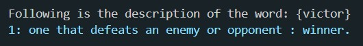
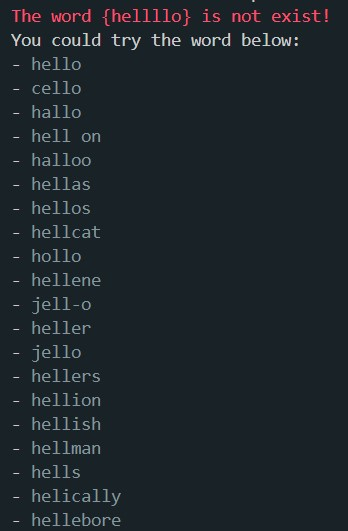

# Simple Dictionary 
<a name="readme-top"></a>

<!-- TABLE OF CONTENTS -->
<details>
  <summary>Table of Contents</summary>
  <ol>
    <li>
      <a href="#about-the-project">About The Project</a>
      <ul>
        <li><a href="#built-with">Built With</a></li>
      </ul>
    </li>
    <li>
      <a href="#getting-started">Getting Started</a>
      <ul>
        <li><a href="#prerequisites">Prerequisites</a></li>
        <li><a href="#installation">Installation</a></li>
      </ul>
    </li>
    <li><a href="#usage">Usage</a></li>
    <li><a href="#notices">Notices</a></li>

  </ol>
</details>


<!-- ABOUT THE PROJECT -->
## About The Project

### Intro 介紹
This is an simple application that you can serach for the word definition.


### Built With
- node.js
- npm package
  - [colors](https://www.npmjs.com/package/colors)
  - [axios](https://www.npmjs.com/package/axios)

- Dictionary API: [The Merriam-Webster Dictionary API](https://dictionaryapi.com/) 

<p align="right">(<a href="#readme-top">back to top</a>)</p>

<!-- GETTING STARTED -->
## Getting Started

### Prerequisites
* node
* npm
  ```sh
  npm install npm@latest -g
  ```

### Installation

1. Clone the repo
   ```sh
   git clone https://github.com/VictorChao996/weird-language-guesser.git
   ```
2. Install NPM packages
   ```sh
   npm install
   ```


<p align="right">(<a href="#readme-top">back to top</a>)</p>


<!-- USAGE EXAMPLES -->
## Usage
- After install you can simply execute by the terminal. Pass your input as the argument to the index.js file.
```sh
node index.js [word]
```

### Example

#### Success result:
Search the word "victor"
```sh
node index.js victor
```


#### Failure result:
The respone will be the recommended word you could search for if the input is unknown.
```sh
node index.js hellllo
```



<p align="right">(<a href="#readme-top">back to top</a>)</p>

## Notices
> **Warning**
> - The API call has a limited in 1000 calls per day.The script will not be able to work if the limit was reached.

> **Note**
> - This is a simple project on practice calling the API.
> - The idea was inspired from the tutorial: https://teamtreehouse.com/library/nodejs-basics-3/project-overview


